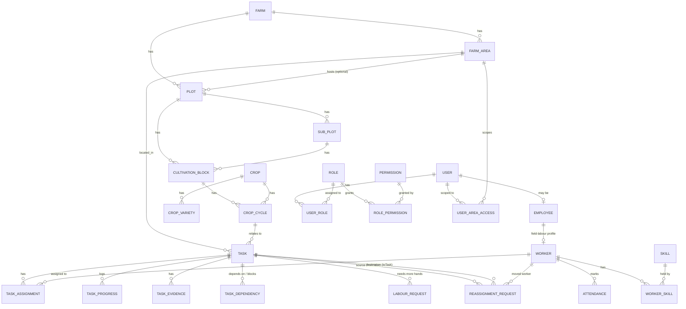

# Database ERD — Athachi Farms FMS

Full schema: `apps/api/prisma/schema.prisma` (source of truth — this document explains and groups it).

## Design decisions

- **Audit columns as plain scalars.** Every operational table carries `createdById`/`updatedById`
  (spec §12). With ~60 tables each pointing at `User` twice, modelling both as named Prisma relations
  would force ~120 back-reference arrays onto the `User` model for no query benefit. They're plain
  `String` columns, indexed where queried, resolved at the application layer. `farmId` **is** a real
  relation (only one target, no naming collision).
- **Soft delete.** `deletedAt DateTime?` on every entity that can be removed; nothing is hard-deleted
  except join-table rows and log-style tables (audit log, progress log) that are append-only by nature.
- **Status columns.** Where a domain-specific enum exists (`TaskStatus`, `IssueStatus`, …) it satisfies
  spec §12's generic "Status" column requirement — no redundant second status field.
- **PostGIS deferred to Phase 3.** `boundary` is a plain `Json` GeoJSON column and `centerLat`/`centerLng`
  are `Float`s, not PostGIS geometry types. Leaflet renders GeoJSON directly, so the Phase-3 migration to
  real `geography` columns + spatial indexes is additive, not a breaking change to the map UI.
- **Single Prisma schema, phased module wiring.** Every table below exists in the database today. Only
  the ✅ modules have a NestJS controller/service; the rest are ready for a later pass to attach to
  without a schema rework.

## Milestone 1 core (✅ wired)

Notable relationships not obvious from field names:
- `Task.assignedSupervisorId` and every `*ApprovedById` / `*RequestedById` / `*DecidedById` column are
  `User.id` references (scalar, see above) — a supervisor is a `User`, not an `Employee`, in these
  fields, matching who actually logs in and gets notified.
- `TaskAssignment.isActive` is the whole mechanism behind "a worker can't be double-booked": it's never
  deleted, only flipped to `false` with `unassignedAt` set, so assignment history survives a
  reassignment (spec §5.3, §13).
- `ReassignmentRequest` is deliberately separate from `LabourRequest`: the former moves an
  **already-assigned** worker (needs the overlap-safe approval flow in `LabourService`); the latter is
  an unassigned headcount ask against a task that hasn't got enough hands yet.

## Everything else (schema-complete, not yet wired to an API)

| Module (spec §) | Prisma models |
|---|---|
| Inspections & issues (§5.16) | `Inspection`, `Issue`, `CorrectiveAction` |
| Nursery & seeds (§5.6) | `SeedLot`, `SeedStorageReading`, `GerminationTrial`, `NurseryBatch` |
| Soil & plant health (§5.7) | `SoilTest`, `PlantHealthRecord`, `PestTreatment` |
| Organic inputs (§5.8) | `OrganicInputRecipe`, `OrganicInputBatch`, `InputApplication` |
| Inventory & procurement (§5.9) | `InventoryItem`, `InventoryBatch`, `StockLocation`, `StockMovement`, `StockCount(Line)`, `Vendor`, `PurchaseRequisition(Line)`, `PurchaseOrder(Line)`, `GoodsReceipt(Line)` |
| Machinery (§5.10) | `Asset`, `MachineryUsage`, `MaintenanceRequest`, `MaintenanceRecord` |
| Harvest (§5.11) | `HarvestForecast`, `HarvestBatch`, `HarvestQualityRecord` |
| Distribution (§5.12) | `Recipient`, `Dispatch`, `DispatchItem`, `ProofOfDelivery` |
| Dairy & livestock (§5.13) | `Animal`, `AnimalHealthRecord`, `MilkCollection`, `MilkQualityTest` |
| Value-added processing (§5.14) | `ProductionBatch`, `ProductionBatchInput`, `ProductionBatchOutput` |
| R&D (§5.17) | `RAndDTrial`, `TrialObservation` |
| Expenses & petty cash (§5.18) | `Expense`, `PettyCashTransaction` |
| Crop calendar engine (§5.5) | `CropCalendar`, `CropActivity` (models exist; the recurring-task generator and compliance scoring described in §5.5/§9 is not implemented yet) |
| Cross-cutting | `MediaFile`, `Comment`, `Notification`, `Approval`, `MeetingRecord`, `ActionItem`, `AuditLog` |

Attaching a Phase 2 module is: write the DTOs + service + controller against the existing tables, add its
nav entry's `built: true` in `apps/web/src/lib/nav-config.ts`, and build the screens — no migration
required for the tables listed above (only for genuinely new needs discovered along the way).
